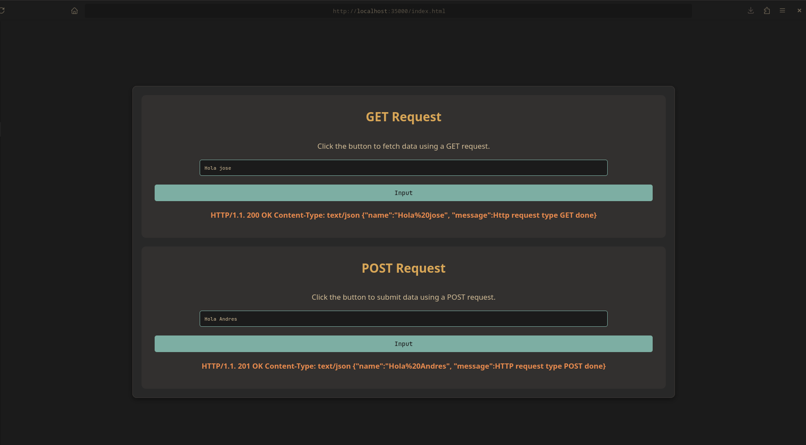
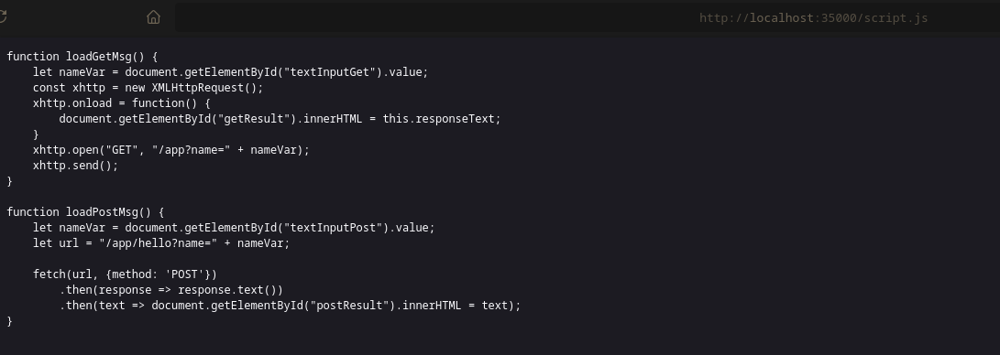
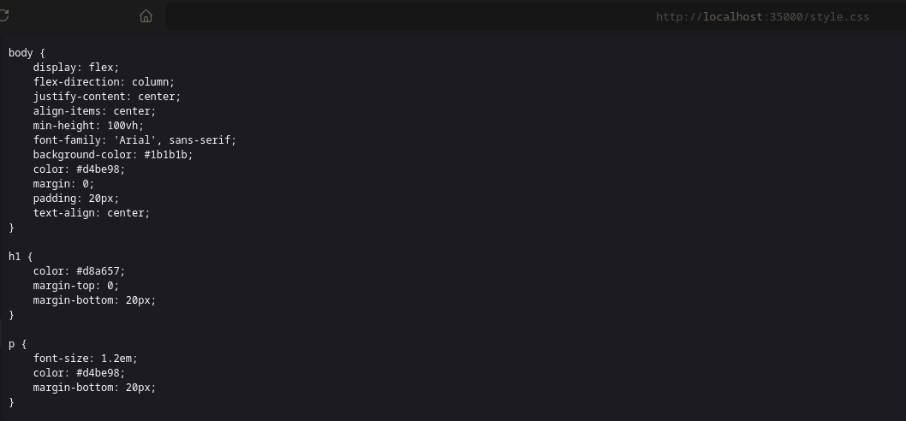
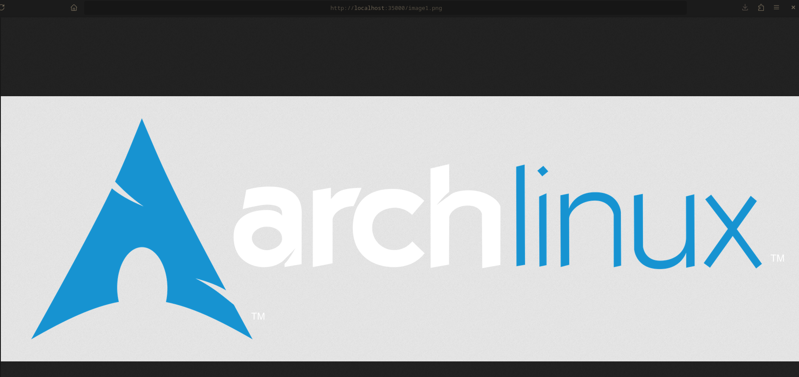
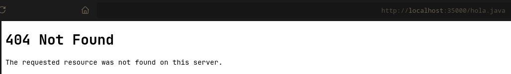
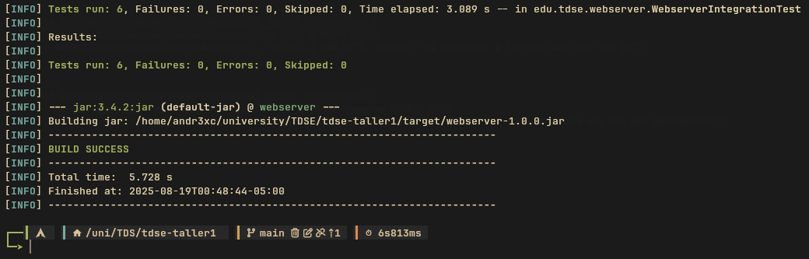

<div align="center">
<h1 align="center">Manual Web Server</h1>
<p align="center">
Web server without frameworks, that supports multiple non-concurrent requests
</p>
</div>

</br>

## About
This project is a handcrafted web server, built from the ground up in pure Java without relying on any external frameworks. Instead of using pre-built tools, this server connects directly to the network to read and understand the fundamental language of the web. It’s designed to be a reliable workhorse, expertly serving static files like HTML pages, CSS stylesheets, and images right to your browser. 

Beyond just files, it's also equipped to run a simple, dynamic API, making it a versatile tool for various web tasks. This project peels back the layers of modern abstractions to show how the core conversation between a browser and a server truly works.es.

</br>
</br>

## Installation & usage

### Prerequisites

To run this server correctly, you need the following applications installed:
- Java
- Bash
- Git

</br>

### Installation

- Clone the repository and navigate into the project directory where the pom.xml is located:

```sh
git clone https://github.com/Andr3xDev/manual-web-server
cd  manual-web-server
```

- Build the project & run it:

```sh
mvn clean verify
java -jar target/webserver-1.0.0.jar
```


The console should display the message of connection:
```
INFO: Server started on port: 35000
```

</br>
</br>

## Test Report

### Acceptance Tests


Manual acceptance tests were performed by requesting different resources to confirm they are served correctly, including:

- index.html



- script.js



- styles.css



- image1.png



- Not existing resources



</br>

### Unit Tests

There are a suite of integration tests validates server reliability by booting a live instance and sending real HTTP requests. These tests confirm that both static and API endpoints return the expected status codes, headers, and content, ensuring correct end-to-end behavior.


